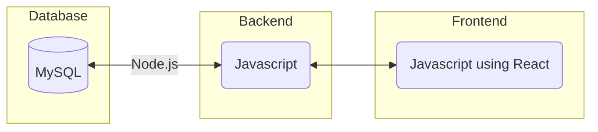
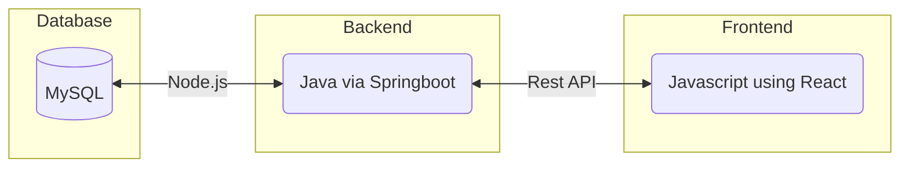

## Needed packages
- Do `npm install` as long as their is a package.json in this directory

## How to start Project
- npm start

#### Technology Stack

<!--Here are some sample technology stacks that you can use for inspiration:-->
Frontend - REACT Website

Backend - webscraping Linkedin

Database - Usernames and Passwords

